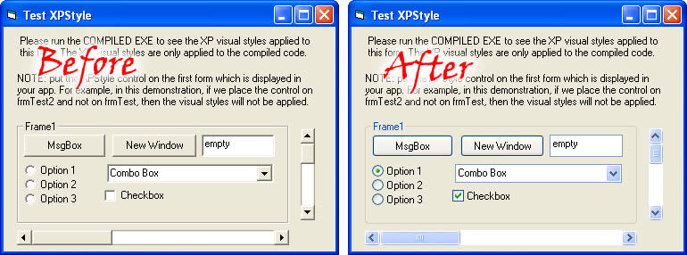



## Improved XP Styles \(UPDATED\)

### Description

ONLY FOR WINDOWS XP OR ABOVE

This is the Professional approach to enable XP visual styles in vb app. No Manifest files....no mess...2-3 clicks do the job. Actually, i was coding an app and wanted to implement xp visual styles in it. I found many submissions on PSC which were using the same technique, i.e create a manifest file in the same directory as the executable. Then i looked at Microsoft's apps like Notepad.exe, and wondered that they did not use any manifest file, actually the real technique is to embed the manifest XML in the exe's resources. So, here it is, the Easiest Professional approach to XP Styling. The procedure is simple, add the XPStyle user control and manifest.res to the VB Project and place the XPStyle user control on the very first form that loads in your app (mostly the MDI form) and then compile your code and run it to view the XP Styles applied. Isn't it easy...Please do vote if you like my submission. I'm not boasting that its the BEST technique, but i guarantee its the easiest and most workable thing.
 
### More Info
 
u need to know what are resources and how to add a resource to VB project in VB IDE

it only works on windows xp or above...

             |
---                |---
**Submitted On**   |2004-06-29 00:20:28
**By**             |[Amer Tahir](https://github.com/Planet-Source-Code/PSCIndex/blob/master/ByAuthor/amer-tahir.md)
**Level**          |Intermediate
**User Rating**    |4.9 (102 globes from 21 users)
**Compatibility**  |VB 6\.0
**Category**       |[Miscellaneous](https://github.com/Planet-Source-Code/PSCIndex/blob/master/ByCategory/miscellaneous__1-1.md)
**World**          |[Visual Basic](https://github.com/Planet-Source-Code/PSCIndex/blob/master/ByWorld/visual-basic.md)
**Archive File**   |[Improved\_X1763406282004\.zip](https://github.com/Planet-Source-Code/amer-tahir-improved-xp-styles-updated__1-54590/archive/master.zip)

